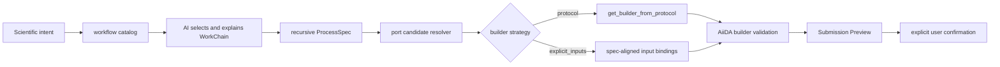

# AiiDA workflow discovery and input binding

ARIS exposes factual AiiDA capabilities to an AI runtime without moving model
orchestration into `aiida-worker`. The model selects a workflow; the worker
provides the installed catalog, ProcessSpec, compatible database entities, and
deterministic builder validation.

## Protocol sequence

1. Call `aiida_workflow_catalog` (`workflow.catalog`) and compare structured
   descriptions, supported protocols, builder strategies, and required inputs.
2. Call `aiida_submission_spec` (`submission.spec`) for the selected entry point.
3. For required AiiDA entity ports, call `aiida_input_candidates`
   (`workflow.input_candidates`) with the exact dotted port path. Never invent a
   PK, UUID, code label, group, or node.
4. Prepare a preview with one explicit strategy:
   - `builder_strategy="protocol"` uses `get_builder_from_protocol` plus code,
     structure, protocol arguments, and overrides.
   - `builder_strategy="explicit_inputs"` binds the `inputs` object directly to
     the inspected ProcessSpec. This supports WorkChains without a protocol
     builder.
5. Validate the resulting builder. Missing ports and validator failures remain
   structured errors.
6. ARIS presents the Submission Preview and requires explicit user confirmation.
   The MCP server deliberately exposes no submit tool.

The catalog is descriptive rather than a domain keyword classifier. Adding an
AiiDA plugin therefore updates the available workflow facts through its entry
point and ProcessSpec instead of requiring a new ARIS phrase list.
