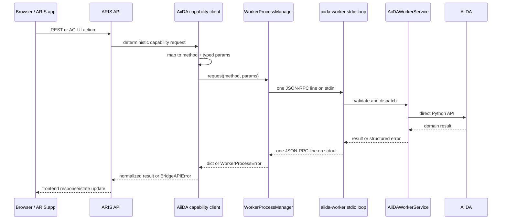

# ARIS and aiida-worker internal flow

The source diagram is
[`diagrams/aris-aiida-worker-internals.mmd`](./diagrams/aris-aiida-worker-internals.mmd).

## Runtime ownership

ARIS is the only long-lived application process that owns AiiDA integration.
During FastAPI lifespan startup, `src/app_api.py` creates one
`WorkerProcessManager`. It launches:

```text
<aiida-worker>/.venv/bin/python3 -u -m aris_aiida_worker
```

The child process uses the worker repository as its working directory. ARIS
keeps stdin, stdout, and stderr pipes; no socket is opened. Shutdown sends
`runtime.shutdown`, waits for a clean exit, and terminates the child only if it
does not exit in time. A crashed process is recreated on the next request.

PM2 is optional tooling for the ARIS API and Vite development server. It does
not own aiida-worker.

## Request sequence



`WorkerProcessManager` serializes requests with one async lock. This deliberately
keeps AiiDA profile/session access deterministic. stderr is captured separately
and never contaminates the JSON-RPC stream.

## Protocol

Every request is a JSON-RPC 2.0 object:

```json
{"jsonrpc":"2.0","id":17,"method":"node.summary","params":{"pk":42}}
```

Every success returns a JSON object in `result`. Domain failures preserve a
machine-readable `kind`, message, HTTP-compatible status code for the ARIS
frontend boundary, and contextual fields:

```json
{
  "jsonrpc": "2.0",
  "id": 17,
  "error": {
    "code": -32000,
    "message": "Node not found",
    "data": {"kind": "not_found", "status_code": 404, "pk": 42}
  }
}
```

The status code is metadata for ARIS' public web API; it is not an internal HTTP
transport.

Context formerly encoded as headers is converted into explicit params:

- `session_id`
- `project_id`
- `workspace_path`
- `python_interpreter_path`

Files are base64-encoded for `data.import` and `group.export_archive`.

## Capability groups

| Group | Examples | Responsibility |
| --- | --- | --- |
| Runtime | `runtime.status`, `runtime.shutdown` | Lifecycle and health |
| Environment | `environment.inspect`, `environment.default` | Validate selected Python environments |
| Profile/archive | `profile.list`, `profile.switch`, `archive.list` | AiiDA profile selection |
| System/resource | `system.info`, `resource.summary`, `resource.plugins` | Read-only runtime inventory |
| Infrastructure | `infrastructure.setup`, `infrastructure.setup_code`, exports | Computers, transports, auth, codes |
| Submission | `submission.spec`, `submission.builder_draft`, `submission.validate`, `submission.submit` | Build and submit workflows |
| Process/node | `process.detail`, `process.logs`, `node.summary`, `node.recent` | Provenance and inspection |
| Group/data | `group.*`, `data.*` | Collections, repositories, imports, binary archives |
| Execution/registry | `execution.run_python`, `registry.*` | Selected-interpreter scripts |

The canonical method registry is `AiiDAWorkerService._handlers`. Adding a new
capability requires a named method, validated params, implementation, and
protocol regression test. Semantic keyword inference is not used.

## Python environments

There remain two intentional environments:

1. ARIS environment: UI API, chat orchestration, policies, and session state.
2. aiida-worker environment: `aiida-core`, plugins, profiles, ORM, and worker
   capability code.

For project-specific computation, ARIS passes an explicit
`python_interpreter_path` and `workspace_path`. `DynamicExecutionRuntime`
validates that interpreter and launches a short-lived computation subprocess.
This is different from starting another worker server.

## Health semantics

The compute-environment card is online only when `runtime.status` succeeds.
The response contains the active profile, resource counts, plugins, worker
Python path, and `transport: "stdio-jsonrpc"`. No `:8001` probe exists and no
second PM2 process can drift out of sync.

## Source ownership

ARIS:

- `src/app_api.py` — lifecycle owner
- `src/aris_core/runtime/worker_process.py` — subprocess and JSON-RPC transport
- `src/aris_apps/aiida/client.py` — application adapter and result normalization
- `src/aris_apps/aiida/capabilities.py` — capability boundary

aiida-worker:

- `src/aris_aiida_worker/stdio.py` — newline protocol loop
- `src/aris_aiida_worker/protocol/` — schemas and domain errors
- `src/aris_aiida_worker/service.py` — capability registry/dispatch
- `src/aris_aiida_worker/application/` — profile-adjacent domain services
- `core/` — AiiDA, submission, serialization, and dynamic execution internals

The worker intentionally has no `main.py`, FastAPI routers, SSE compatibility
surface, uvicorn dependency, or network server.
