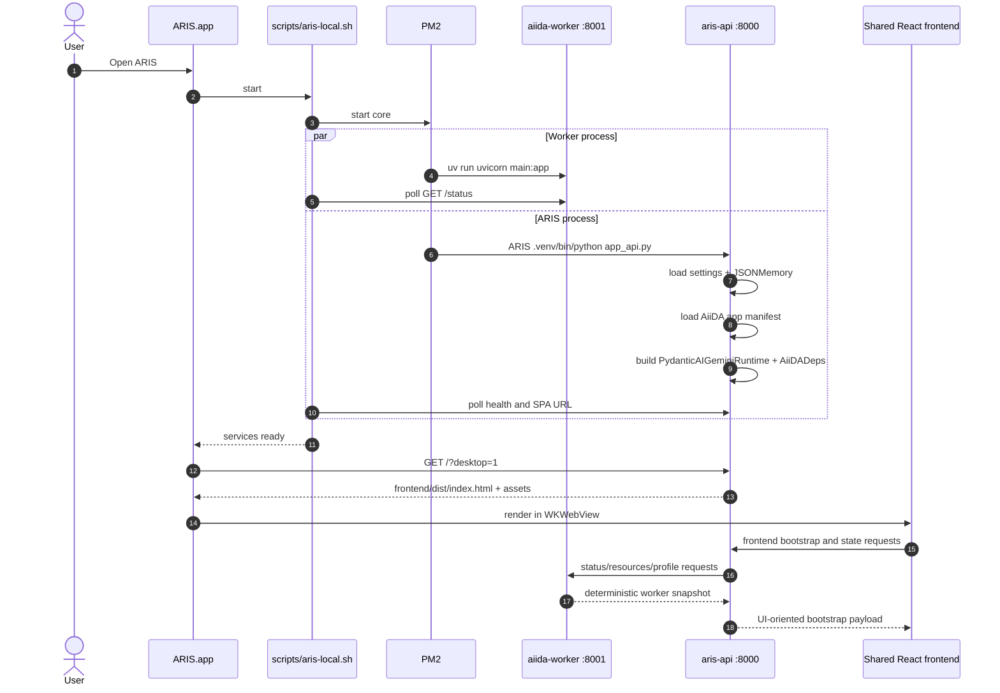
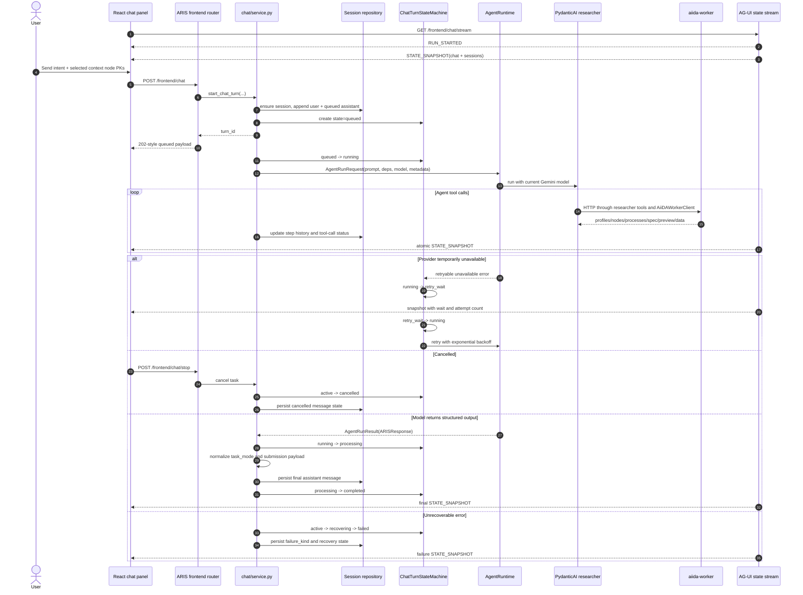
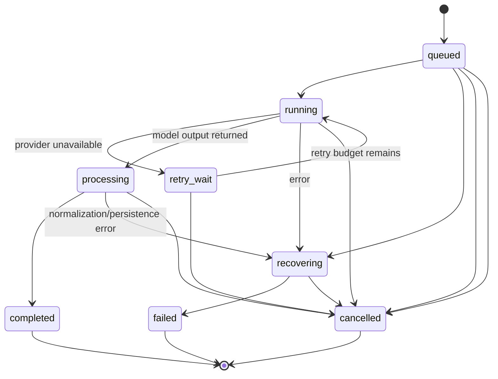
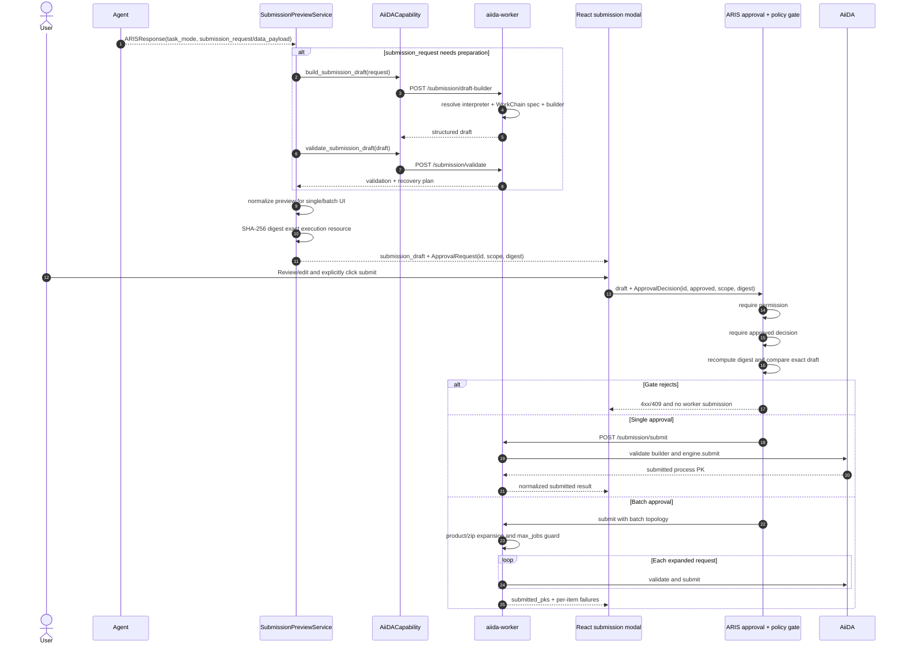
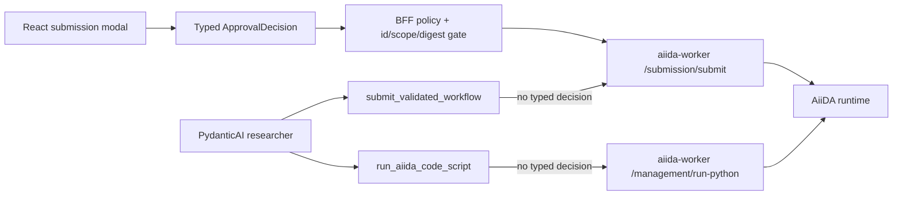
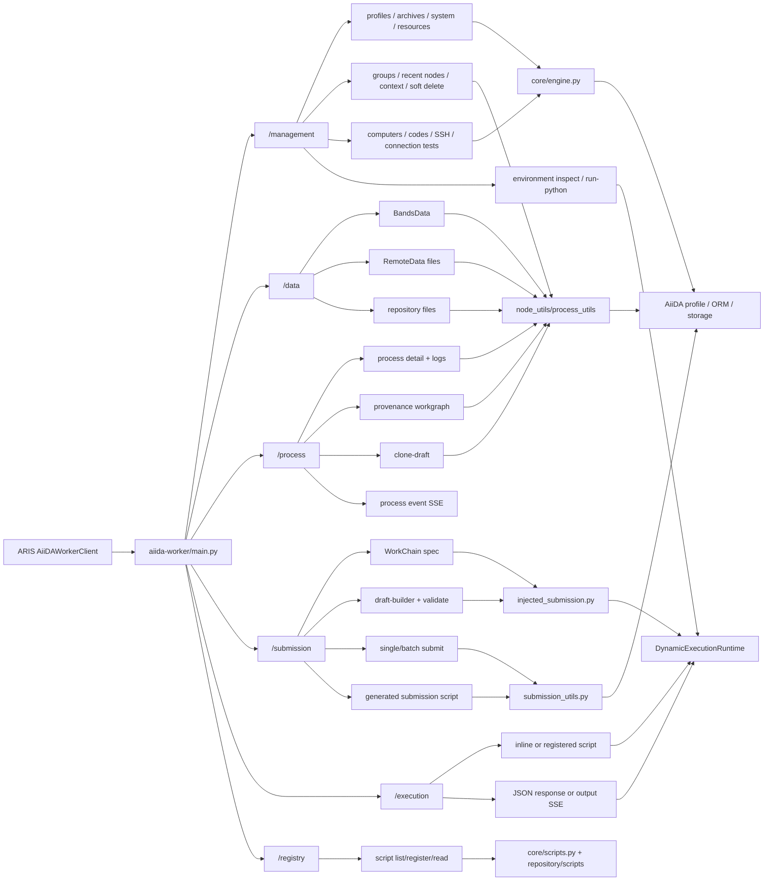
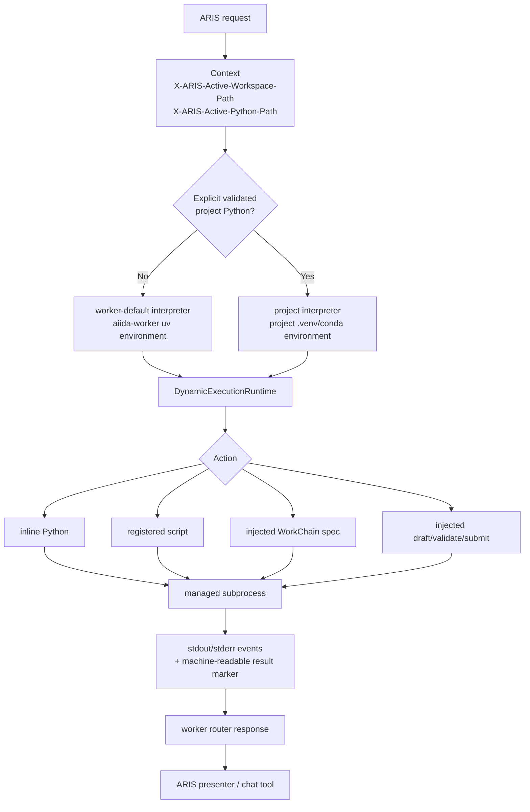
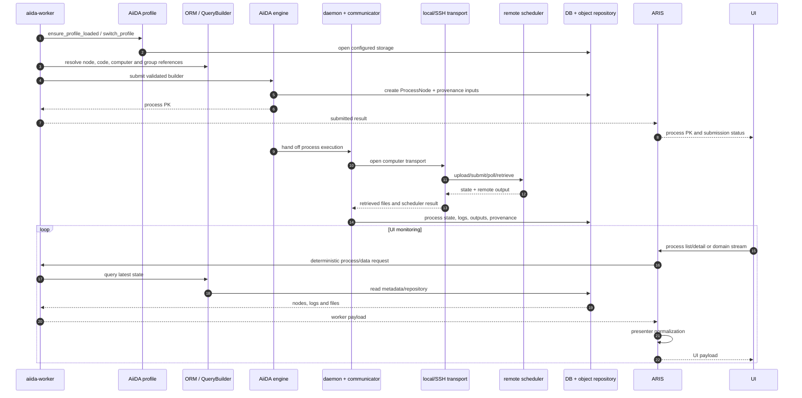
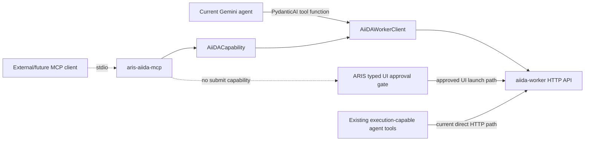

# ARIS and aiida-worker internal flow

This document describes the implementation that exists on `main` at commit
`3d77acc`. It is a code map, not a target-state proposal.

The canonical editable overview is
[`diagrams/aris-aiida-worker-internals.mmd`](./diagrams/aris-aiida-worker-internals.mmd).
The compact pre-rendered version is
[`diagrams/aris-aiida-worker-internals.svg`](./diagrams/aris-aiida-worker-internals.svg).
Solid arrows are active runtime paths. Dashed arrows are optional, development,
or prepared-but-not-default paths.

## System overview

```mermaid
flowchart LR
    USER["User"] --> SURFACE{"Application surface"}
    SURFACE --> BROWSER["Browser"]
    SURFACE --> MAC["ARIS.app<br/>AppKit + WKWebView"]

    BROWSER --> REACT["Shared React frontend"]
    MAC --> REACT

    REACT -->|"REST"| BFF["ARIS FastAPI BFF<br/>127.0.0.1:8000"]
    BFF -->|"AG-UI over data-only SSE"| REACT
    BFF --> CHAT["Chat/session/approval<br/>application services"]
    CHAT --> RUNTIME["AgentRuntime protocol"]
    RUNTIME --> GEMINI["PydanticAI + Gemini"]
    GEMINI --> TOOLS["AiiDA researcher tools"]
    TOOLS -->|"current path: HTTP"| CAP["AiiDAWorkerClient / capability"]
    BFF -->|"deterministic UI commands"| CAP
    CAP -->|"HTTP bridge"| WORKER["aiida-worker FastAPI<br/>127.0.0.1:8001"]
    GEMINI -->|"submit_validated_workflow / run_aiida_code_script<br/>remaining direct execution path"| WORKER
    WORKER --> AIIDA["AiiDA profile, ORM,<br/>engine, daemon and repository"]
    AIIDA --> REMOTE["local/SSH computer<br/>and scheduler"]

    MCP["FastMCP facade<br/>inspect + preview only"] --> CAP
    MCP_CLIENT["External/future MCP client"] -.-> MCP
    GEMINI -. "not currently an MCP client" .-> MCP

    CHAT --> ARIS_STORE["ARIS JSON sessions<br/>and project workspace"]
    AIIDA --> AIIDA_STORE["AiiDA database<br/>and object repository"]
```

The two persistence areas are intentionally separate:

- ARIS owns conversations, projects, UI/application state, generated files and
  the approval workflow.
- `aiida-worker` owns access to AiiDA profiles, nodes, groups, provenance,
  computers, codes and process execution.

The macOS application is a native launcher and WebKit shell, not a second
frontend implementation. Production browser and desktop surfaces both load the
same React build served by ARIS on port 8000. Development mode swaps only the
frontend origin for Vite on port 5173.

## Process and repository boundaries

| Boundary | Repository / environment | Responsibility | Important entry points |
|---|---|---|---|
| Native shell | `aris`, system Objective-C toolchain | Start services, host the shared frontend in `WKWebView` | `desktop/macos/main.m`, `scripts/aris-local.sh` |
| UI | `aris/frontend`, Node build environment | Layout, user interaction, state projection, explicit approval decision | `frontend/src/App.tsx`, `frontend/src/lib/api.ts`, `frontend/src/lib/ag-ui.ts` |
| ARIS host | `aris`, ARIS `.venv` | FastAPI BFF, agent orchestration, sessions, policy, AG-UI, payload presentation | `src/app_api.py`, `src/aris_apps/aiida/router.py` |
| Agent adapter | `aris`, ARIS `.venv` | Provider-neutral runtime contract and current Gemini implementation | `src/aris_core/agent/runtime.py`, `src/aris_apps/aiida/agent/runtime.py` |
| Capability facade | `aris`, ARIS `.venv` | Stable AiiDA application port, HTTP adapter, optional MCP facade | `capabilities.py`, `client.py`, `mcp_facade.py` |
| Execution worker | `aiida-worker`, worker `uv` environment | Deterministic AiiDA REST API and selected-interpreter subprocess execution | `main.py`, `routers/`, `core/` |
| Scientific runtime | active AiiDA profile and compute environment | ORM, provenance, engine/daemon, transports, scheduler jobs and repositories | AiiDA configuration, storage and remote computers |

PM2 starts ARIS and `aiida-worker` as separate processes. This is why the ARIS
Python environment and the calculation/plugin environment do not have to be the
same environment.

## Application startup

Closing the app window does not stop PM2 services. That is deliberate: AiiDA
workflows and the daemon must be able to continue after the UI closes.

## Chat turn and state synchronization

`POST /frontend/chat` does not hold the HTTP request open for model completion.
It queues an `asyncio.Task`, returns the `turn_id`, and lets the AG-UI stream
project the authoritative server state into React.

The state machine accepts only these transitions:

## Protocol-first preview and approval flow

The normal React submission path does not let the AI control UI topology
through keywords. It returns a validated `ARISResponse`:

- `task_mode="none"`: no runnable preview.
- `task_mode="single"`: exactly one runnable preview.
- `task_mode="batch"`: multi-structure, parameter-grid or high-throughput
  preview.
- A runnable mode must carry either a structured `submission_request` or a
  ready `data_payload.submission_draft`.

If the UI changes the draft after the server created the request, the digest no
longer matches and the approval is invalid. A fresh approval must be generated
for the changed resource.

### Current approval-boundary exception

The typed gate above is authoritative for the React submission and clone
dialogs, but it is not yet the only execution path in the repository.
`aiida_researcher` still registers:

- `submit_validated_workflow`, which reads `aiida_pending_submission` from the
  dependency registry or global `JSONMemory` and calls worker
  `/submission/submit` through `agent/tools.py`.
- `run_aiida_code_script`, which calls worker `/management/run-python` and can
  execute AiiDA-aware Python.

Those calls go directly from the agent tool layer to `aiida-worker`; they do not
carry `ApprovalDecision` and are not checked by the BFF's
`require_permission("/aris/submissions/current", "execute")` dependency.
Their safety currently depends on the agent prompt and model behavior. This is
an important remaining architecture gap, not part of the desired approval
design.

## Worker router and core-module map

`SessionCleanupAPIRouter` wraps ORM-facing endpoints so thread-local storage
sessions and backend caches are released after requests. `db_access_guard`
limits concurrent database access and returns a controlled 503 instead of
letting requests exhaust the storage pool.

## Worker interpreter selection

The selected project interpreter does not replace the worker service
environment. The worker remains alive in its own `uv` environment and launches
a bounded subprocess using the selected interpreter. The project workspace is
passed separately and remains an ARIS-owned filesystem location.

## AiiDA execution and feedback path

## MCP status

`uv run aris-aiida-mcp` starts a stdio FastMCP server in the ARIS repository.
It exposes ten inspect/preview tools, three resources and one protocol prompt.
Every operation delegates to the same `AiiDACapability` port used by the
application.

It intentionally has no submit tool. The current `PydanticAIGeminiRuntime` also
does not connect to this MCP server: its registered PydanticAI tools call the
HTTP worker client directly. Therefore:

The MCP facade is an alternate protocol surface over AiiDA capabilities, not a
second model orchestrator. It does not introduce an approval bypass; the
existing agent tool layer described above is the current bypass.

## Current code-level gaps exposed by this map

These are observations from the current call graph, not target-state elements:

1. **Typed approval is not yet universal.** The execution-capable researcher
   tools described above can reach worker submission or Python execution
   without an `ApprovalDecision`.
2. **The MCP facade is not connected to the current agent runtime.** It is a
   runnable stdio server for an external/future MCP client, while the current
   Gemini agent uses in-process PydanticAI tool functions and HTTP.
3. **One MCP capability route does not match the worker router.**
   `HttpAiiDACapability.list_submission_plugins()` requests
   `/submission/plugins`, while the current worker exposes `GET /plugins`.
   The MCP `aiida_submission_plugins` tool therefore needs an adapter or route
   correction before it can work against this worker unchanged.
4. **The worker process-event producer is not started by `main.py`.**
   `/process/events` subscribes clients to `BroadcastManager`, and
   `core/events.py` defines `aiida_event_listener()`, but no current code calls
   that listener. The ARIS frontend process stream uses its own refresh logic;
   developers should not assume the worker event stream has an active producer.
5. **A worker compatibility entry remains.** `aiida_bridge.py` only re-exports
   `main.app`; PM2 starts `main:app`, so the re-export is not part of the normal
   launch path.

## Developer tracing guide

For a chat request, trace in this order:

1. `frontend/src/lib/api.ts` and `frontend/src/components/dashboard/chat-panel.tsx`
2. `src/aris_apps/aiida/router.py`
3. `src/aris_apps/aiida/chat/service.py`
4. `src/aris_apps/aiida/chat/turn_state_machine.py`
5. `src/aris_core/agent/runtime.py`
6. `src/aris_apps/aiida/agent/runtime.py`
7. `src/aris_apps/aiida/agent/researcher.py` and `agent/tools.py`
8. `src/aris_apps/aiida/client.py`
9. `aiida-worker/routers/*`
10. `aiida-worker/core/*`

For a submission, trace in this order:

1. `ARISResponse.task_mode` and `submission_request` / `data_payload`
2. `SubmissionPreviewService`
3. worker `/submission/draft-builder` and `/submission/validate`
4. `ApprovalRequest` rendered by React
5. `ApprovalDecision` constructed by `frontend/src/lib/api.ts`
6. ARIS policy and digest verification
7. worker `/submission/submit`
8. `core/injected_submission.py` or `core/submission_utils.py`
9. AiiDA `engine.submit`

For process inspection, trace:

1. React process/detail components
2. ARIS frontend process routes
3. ARIS presenter layer
4. `AiiDAWorkerClient`
5. worker `routers/process.py` or `routers/data.py`
6. `core/process_utils.py` / `core/node_utils.py`
7. AiiDA ORM and repository

## Important invariants

- Browser and macOS must keep one shared React codebase.
- AI intent that changes workflow topology must use explicit structured fields,
  especially `task_mode`; domain keyword matching is not an acceptable
  substitute.
- Preview construction and workflow execution are separate operations.
- The intended workflow-launch invariant is an explicit typed user decision
  bound to the exact draft digest. Current execution-capable agent tools violate
  this invariant and should be removed or routed through the same gate.
- MCP must not gain a submit tool unless the ARIS approval boundary is preserved
  by design.
- ARIS session JSON/workspace files and AiiDA storage are different persistence
  domains.
- The ARIS Python environment, worker service environment and selected project
  interpreter are separate runtime concerns.
